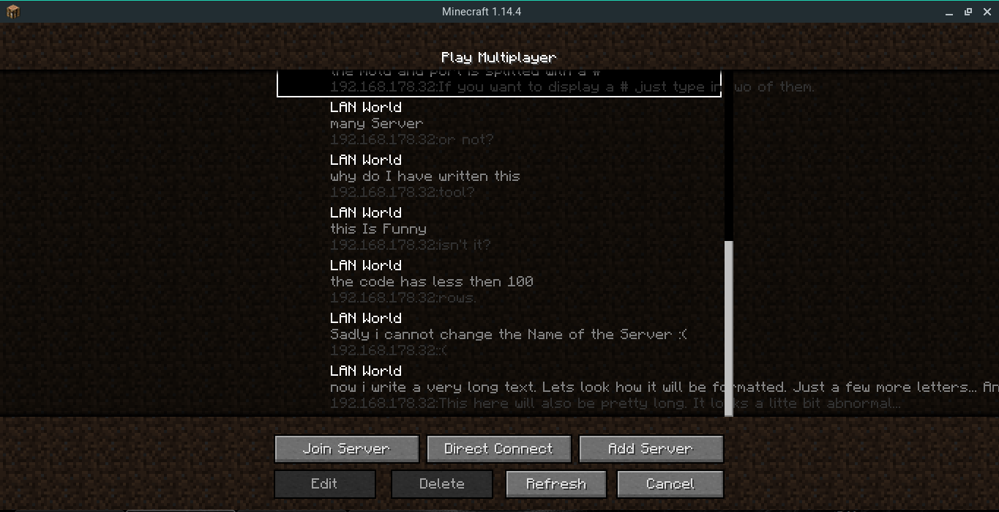

# minecraftLanBeaconSpammer
Can display many local Server in the Minecraft Multiplayer List

use it by typing in "python3 <file> <delay>"

the file is the just the name of the file where the server motds and ports are saved.
The Format is motd#port if you want to display a # just type ##. A new Line just means a new Server.

The delay is optional. The Default is 1000 for 1 Secound or 1000 milisecounds.

